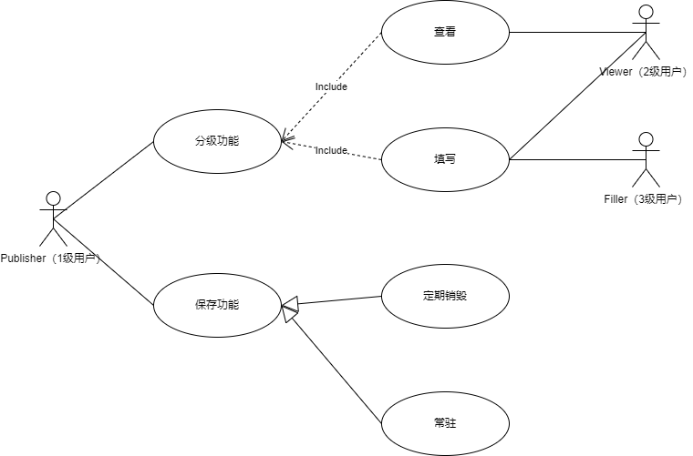

# DocumentMerging需求分析

## ##使用配置文件避免信息泄露##

## 账号模块

* 用户分级
  * 分三级
* 使用手机号注册

## 文档、问卷转换功能

### 收集问卷转换Excel

* 将收集到的信息以json保存于Redis并设置过期时间

* 使用sched模块结束问卷并生成excel

#### 生成表格

* 可选，提供谁拥有填写权限（手机号）
* 可选，填写分级权限（手机号）
  * 查看
  * 修改
* 生成表格后将UUID、短链、拥有者保存于MySQL

~~~ 
在生成表格时，可选填写过期时间。
填写过期时间的表格使用Redis进行缓存短链，减少读时压力。
未填写过期时间采用热点机制，当规定时间内访问次数达到阈值时进行Redis缓存。
~~~

### Excel表格生成问卷星

| 行数 | 意义                                            |
| ---- | ----------------------------------------------- |
| 1    | 行头                                            |
| 2    | 数据类型                                        |
| 3    | 是否必填（*为是）                               |
| 4    | 样例，如果数据类型为radio或checkbox则为可选条件 |

* 提供的数据类型
  * number：数字类型
  * string：文本
  * radio：单选框
  * checkbox：复选框

### 文档合并

* 提供行表，列表并合并，其中列作为主键
* 提供已经填写部分的excel进行解析，默认第一列为主键

# 时序图

## 用户注册

## 填写问卷

## 检查问卷填写内容

# 用例图

内容：参与者可以实现什么功能，功能和功能之间的关系。

~~~ 
泛化：购票-》线上购票、线下购票 
包含：保存成绩-》录入成绩、修改成绩 include
拓展：登录---》找回密码（稍微有点关系 extend
~~~

## 登录模块

* 登录
  * 验证码登录（泛化
  * 密码登录（泛化
  * 找回密码（拓展
* 注册

## 发布问卷

* 分级
  * 允许谁查看（包含
  * 允许谁填写（包含
* 保存功能
  * 定期销毁（泛化
  * 常驻（泛化

## 填写问卷

* 权限验证
* 存储功能
  * 修改问卷内容（包含
  * 撤回问卷（包含
  * 填写问卷（包含

## 生成问卷

* 生成问卷
  * 使用Excel生成（泛化
  * 使用CMD填写（泛化
  * 使用前端生成（泛化
* 层级功能
  * 填写查看人：2级（包含、查看问卷结果
  * 填写填写人：3级（包含、仅填写问卷

## 生成文档

* 生成文档
  * 生成本地文档（泛化
  * 生成在线查看链接（泛化

## 合并文档

* 合并文档
  * 合并线上文档
  * 合并本地文档
* 合并方式
  * 通过主键合并
  * 通过行头合并
  * 通过新增主键、新增行头合并

# 活动图

~~~ 
活动图是UML用于对系统的动态行为建模的另一种常用工具,它描述活动的顺序，展现从一个活动到另一个活动的控制流,活动图在本质上是一种流程图；活动图着重表现从一个活动到另一个活动的控制流。
~~~

## 登录

## 发布问卷

## 填写问卷

## 生成问卷

## 生成文档

## 合并文档

